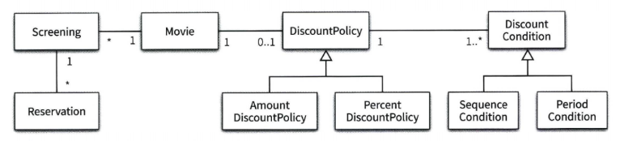

# Object


# 2장 영화 예매 시스템  만들기


### 요구사항  살펴보기

>이번 장에서 소개할 예제는 온라인 영화 예매 시스템이다. 앞으로의 설명을 위해 '영화'와 '상영'이라는 용어를 구분하자.
>
>영화 
>
>- 영화에 대한 기본 정보를 표현
>  - 제목, 상영시간, 가격 정보와 같이 영화가 가지고 있는 기본적인 정보
>
>상영
>
>- 실제로 관객들이 영화를 관람하는 사건을 표현
>  - 상영 일자, 시간, 순번 등을 가리키기 위함
>
>두 용어의 차이가 중요한 이유는 사용자가 실제로 예매하는 대상은 영화가 아니라 상영이기 때문이다.
>
>특정한 조건을 만족하는 예매자는 요금을 할인 받을 수 있다. 영화 할인액을 결정하는 두 가지 규칙이 조건이 있는데
>
>**할인 조건(discount condition)**과 **할인 정책(discount policy)**라고 부른다.
>
>**할인 조건**
>
>- 가격의 할인 여부를 결정
>  - **순서 조건**
>    - ex) 순번이 10인 경우 매일 10번째로 사영되는 영화를 예매한 사용자들에게 할인 혜택을 제공
>  - **기간 조건**
>    - ex) 월요일 시작 시간이 오전10시, 종료 시간이 오후 1시인 기간 조건을 사용하여 할인 혜택을 적용
>
>**할인 정책**
>
>- 할인 요금을 결정
>  - 금액 할인 정책(amount discount policy)
>    - ex) 예매 요금에서 일정 금액을 할인해주는 방식
>  - 비율 할인 정책(percent discount policy)
>    - ex) 예매 요금에서 일정 비율의 요금을 할인해주는 방식
>
>영화에 할인 정책과 할인 조건 설정 방법
>
>- 할인 정책 0..1
>- 할인 조건 0..*
>


### 객체 지향 프로그램밍을 향해

>진정한 객체지향 패러다임으로의 전환은 클래스가 아닌 객체에 초점을 맞출 때에만 얻을 수 있다.
>
>1. 어떤 클래스가 필요한지를 고민하기 전에 어떤 객체들이 필요한지 고민하라
>  - 클래스는 공통적인 **상태**와 **행동**을 공유하는 객체들을 추상화한 것이다. 따라서 클래스의 윤곽을 잡기 위해서는 어떤 객체들이 어떤 상태와 행동을 가지는지 먼저 결정해야 한다. 객체를 중심에 두는 접근 방법은 설계를 단순하고 깔끔하게 만든다.
>
>2. 객체를 독립적인 존재가 아니라 기능을 구현하기 위해 협력하는 공동체의 일원으로 봐야 한다.
>  - 이를 통해 **설계를 유연하고 확장 가능**하게 만든다.
>


### 도메인의 구조를 따르는 프로그램 구조

>소프트웨어는 사용자가 원하는 어떤 문제를 해결하기 위해 만들어 지는데, 영화 예매 시스템의 목적은 영화를 좀 더 쉽고 빠르게 예매하려는 사용자의 문제를 해결하는 것이다. 이처럼 문제를 해결하기 위해 사용자가 프로그램을 사용하는 분야를 **도메인**이라고 부른다.
>
>
>
>```java
>public class Screening {
>	private Movie movie;
>	private int sequence;
>	private LocalDateTime whenScreened;
>
>	Screening(Movie movie, int sequence, LocalDateTime wehnScreened) {
>		this.movie = movie;
>		this.sequence = sequence;
>		this.whenScreened = wehnScreened;
>	}
>	
>	public LocalDateTime getStartTime() {
>		return whenScreened;
>	}
>	
>	public boolean isSequence(int sequence) {
>		return this.sequence == sequence;
>	}
>	
>	public Money getMovieFee() {
>		return movie.getFee();
>	}
>}
>```
>
>여기서 주목할 점은 인스턴스 변수의 가시성은 private이고 메소드의 가시성은 public이라는 것이다.
>Screening 클래스에서 알 수 있는 것처럼 외부에서는 객체의 속성에 직접 접근할 수 없도록 막고 적절한 public 메소드를 통해서만 내부 상태를 변경할 수 있게  해야 한다.
>
>클래스의 내부와 외부를 구분해야 하는 이유는 무엇인가? 
>
>- 경계의 명확성이 객체의 자율성을 보장
>- 프로그래머에게 구현의 자유를 제공


### 자율적인 객체

>1. 객체가 상태(state)와 행동(behavior)을 함께 가지는 복합적인 존재
>2. 객체가 스스로 판단하고 행동하는 자율적인 존재
>
>객체지향은 객체라는 단위 안에 데이터와 기능을 한 덩어리로 묶음으로써 문제 영역의 아이디어를 적절하게 표현할 수 있게 했다. 이처럼 데이터와 기능을 객체 내부로 함께 묶는 것을 **캡슐화**라고 한다.
>
>객체지향은 상태와 행동을 캡슐화하는 것에서 한 걸음 더 나아가 외부에서의 접근을 통제할 수 있는 접근 제어 메커니즘도 함께 제공한다. 따라서 객체 지향은 public, protected, private와 같은 접근 수정자(access modifier)를 제공한다.
>
>객체 내부에 대한 접근을 통제하는 이유는 객체를 자율적인 존재로 만들기 위해서다. 객체지향의 핵심은 스스로 상태를 관리하고, 판단하고, 행동하는 자율적인 객체들의 공통체를 구성하는 것이다. 외부에서는 객체가 어떤 상태에 놓여 있는지, 어떤 생각을 하고 있는지 알아서는 안 되며, 결정에 직접적으로 개입해서도 안된다. 객체에게 원하는 것을 요청하고 객체가 스스로 최선의 방법을 결정할 수 있을 것이라는 점을 믿고 기다려야 한다.
>
>캡슐화와 접근 제어는 객체를 두 부분으로 나눈다.
>
>1. 퍼블릭 인터페이스(public Interface)
>   - 외부에서 접근 가능한 부분
>2. 구현(implemetnation)
>   - 오직 내부에서만 접근 가능한 부분
>
>**인터페이스와 구현의 분리** 원칙은 훌륭한 객체지향 프로그램을 만들기 위해 따라야 하는 핵심 원칙이다.


### 프로그래머의  자유

>


